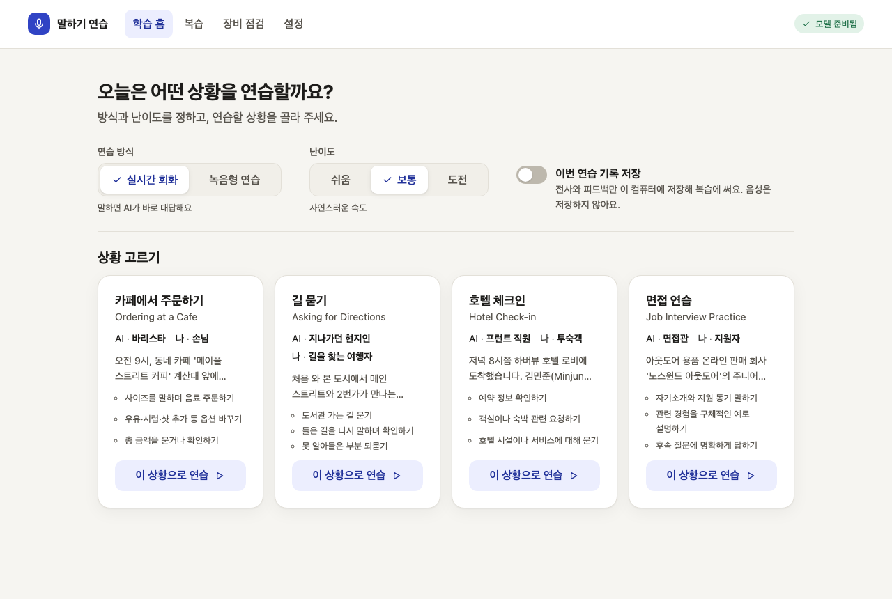
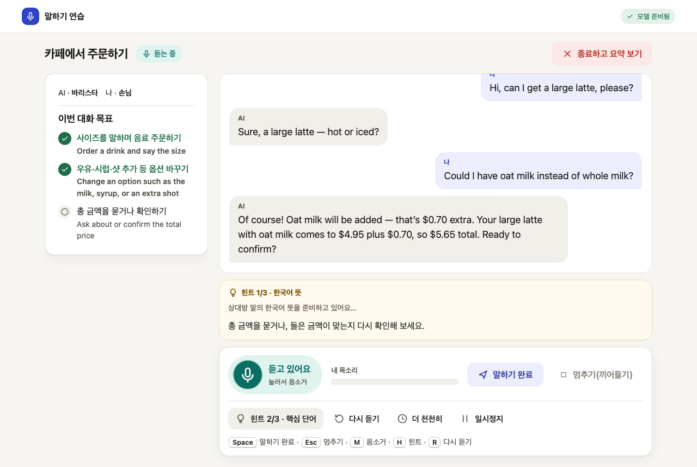
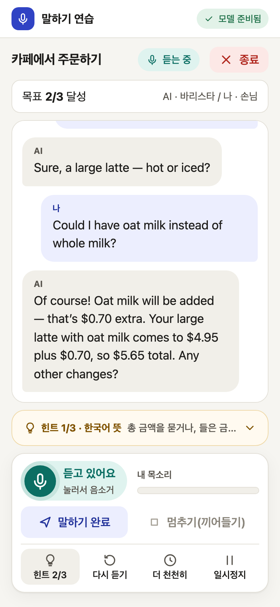

# voice-roleplay (말하기 연습)

[English](README.md) · **한국어** · [소개 페이지](https://cskwork.github.io/voice-roleplay/)

내 컴퓨터에서만 돌아가는 영어 말하기 연습 서비스입니다. 브라우저에서 AI와 영어로 역할극 대화를 하거나(실시간 모드), 문장 읽기·따라 말하기·자유 답변을 녹음해 전사와 텍스트 피드백을 받습니다(녹음형 모드). 음성 인식(Qwen3-ASR-0.6B), 음성 합성(Fun-CosyVoice3-0.5B-2512), 대화 모델(Qwen3-4B-Instruct-2507, llama.cpp)이 모두 로컬에서 실행되고, 설치가 끝난 뒤에는 인터넷 연결 없이 동작합니다.

제품 요구사항은 `docs/PRD.md`, 컴포넌트 간 계약은 `contracts/PROTOCOL.md`에 있습니다.

| 학습 홈 | 실시간 회화 | 모바일 |
|---|---|---|
|  |  |  |

스크린샷은 실제 모델로 실행한 화면입니다. 학습자 음성만 테스트용 합성 음성(macOS `say`)으로 넣었습니다(`tests/e2e/docs/`).

## 현재 상태

개발 중인 버전이며 출시 기준(PRD §15, §18)을 통과하지 않았습니다.

측정된 것 (Apple M3 Pro 36 GB, macOS 26.6.2, 2026-09-27. 다른 작업이 같은 기기에서 돌고 있었으므로 참고용):

| 항목 | 결과 | 출처 |
|---|---|---|
| TTS 스트리밍 첫 청크 p50 / RTF p50·p95, MLX fp16 (기본값) | 1.15 s / 0.55 · 0.72 (48문장) | `workers/tts/benchmarks/2026-09-27T064944+0000-mlx-default-fp16-s5-h50-runs2.json` |
| TTS 같은 항목, PyTorch hybrid (이전 기본값) | 2.97 s / 1.91 · 2.83 | `workers/tts/README.md`, `workers/tts/benchmarks/` |
| LLM 첫 토큰(프리픽스 예열 후 첫 턴) | 264 ms | `config/llm/README.md`, `workers/feedback/bench/results/` |
| ASR 장치 비교 | MPS가 CPU fp32보다 약 2배 빠름 | `workers/asr/README.md` |
| 전체 스택 1회 실행 (`tests/integration/stack_smoke.py`) | 마지막 발화 샘플 → 첫 AI 오디오 프레임 전송 5.6 s(턴 종료 침묵 0.94 s 포함), 끼어들기 음성 시작 → `response.cancelled` 0.32 s, 3초 읽기 녹음 작업 1.0 s | 단일 실행, 벤치마크 아님. 서버 전송 시각이며 실제 재생 시각이 아님 |

측정되지 않았거나 미달인 것:

- 전체 스택 벤치마크(2026-09-28, 200턴, `benchmarks/results/2026-09-29-m3pro.md`): 실시간 응답 시작 p50 3.26 s / p95 4.43 s로 PRD 목표(p50 ≤ 2 s, p95 ≤ 4 s) **미달**, 전체 스택에서 TTS RTF p95 0.87로 목표(≤ 0.8) **미달**입니다. 첫 임시 자막 p95 0.66 s, 끼어들기 정지 p95 0.20 s, 녹음형 30초·120초 결과 시간은 목표를 충족했습니다. 학습자 음성이 아닌 macOS `say` 합성 음성 기준입니다.
- 측정하지 않은 것: 멈추기 버튼 지연, 60분 안정성, 10세션 메모리 회수, 학습자 평가셋 WER.
- 실제 브라우저 종단 간 테스트(Playwright, `tests/e2e/`, 실제 모델) 16개가 모두 통과했습니다(끼어들기, 턴 종료, 녹음형, API 거절, 오프라인·로그 누출 검사, 발음 워커, 세션 요약 다시 말하기 포함). 학습자 마이크 음성만 macOS `say` 합성 음성으로 대체했습니다.

Apple Silicon에서의 차이 (PRD 기준 프로필은 Linux + NVIDIA):

- ASR은 vLLM 스트리밍 대신 transformers 백엔드(MPS)에서 부분 재디코딩으로 임시 자막을 만듭니다. vLLM 어댑터는 있지만 실행해 본 적이 없습니다.
- TTS는 기본값으로 MLX 백엔드(`VR_TTS_BACKEND=auto`)를 씁니다. `VR_TTS_BACKEND=torch`로 공식 PyTorch 코드를 쓸 수 있으며, 이때는 LLM을 CPU, flow를 MPS, HiFT를 CPU에 나눠 올립니다(전부 MPS에 올리면 Metal이 충돌).
- LLM은 Homebrew llama-server(Metal)를 씁니다.

음성 출처: AI 목소리 두 개는 LibriTTS-R 데이터셋의 영어 낭독 음성입니다(CC BY 4.0, 제품 책임자가 2026-09-29 청취 후 선택). 여성 `content/voices/libritts_r_4992_f`(카페 주문, 길 안내), 남성 `content/voices/libritts_r_1188_m`(호텔 체크인, 면접). 라이선스에 따른 저작자 표시:

- "Voice prompt from LibriTTS-R (Y. Koizumi, H. Zen, S. Karita et al., 2023), https://www.openslr.org/141/, speaker 4992, licensed CC BY 4.0. Derived from LibriTTS and LibriVox recordings."
- "Voice prompt from LibriTTS-R (Y. Koizumi, H. Zen, S. Karita et al., 2023), https://www.openslr.org/141/, speaker 1188, licensed CC BY 4.0. Derived from LibriTTS and LibriVox recordings."

낭독자가 음성 복제에 동의한 것은 아니며, 이 점은 제품 책임자가 알고 결정했습니다(각 폴더의 `SOURCE.md`).

출시 전에 바꿔야 하는 것:

- 시나리오 문장, 한국어 번역, 모범 표현은 초안입니다. 원어민 검수와 번역 검수가 필요합니다(`content/README.md`).
- 발음 점수는 없습니다. 모든 결과에서 `pronunciation_score`는 `null`입니다. 선택 구성 요소인 발음 워커(`workers/pronunciation`)가 있으면 녹음형 결과에 단어 위치, 단어별 "내 발음 / 모범 음성" 비교 재생, 억양 곡선(참고 지표)을 보여 주며 판정은 하지 않습니다(`timing_only`). 워커가 없거나 실패하면 `assessment_unavailable`입니다. 단어 등급은 실험 기능(`VR_PRON_EXPERIMENTAL=1`)이고, 보정 데이터가 중국어 모국어 화자(speechocean762)뿐이라 한국인 학습자에 대해서는 검증되지 않았으므로 기본으로 꺼져 있습니다(`docs/pronunciation.md`).

## 빠른 시작

필요한 것: Apple Silicon Mac(검증: M3 Pro 36 GB), 디스크 여유 약 30 GB(모델 약 19 GB, Python 환경 약 5.5 GB), [uv](https://docs.astral.sh/uv/), git, Node.js 22 이상, `brew install llama.cpp`. 선택 구성 요소인 발음 워커는 pyworld를 소스에서 빌드하므로 Xcode Command Line Tools가 필요합니다(없으면 setup이 경고만 하고 발음 분석 없이 설치를 마칩니다).

```sh
./app setup      # 설치 내용을 보여 주고 y/N으로 동의를 받은 뒤 진행 (--yes: 묻지 않음)
./app doctor     # 장비, 런타임, 모델 해시, 포트, 음성, 오프라인 준비 상태 표
./app start      # 워커 예열이 끝나면 http://127.0.0.1:8710 출력
./app stop       # 진행 중 작업 취소, 워커 종료, 남은 프로세스 정리
```

`./app setup`이 하는 일: 각 Python 컴포넌트를 잠금 파일 그대로 `uv sync --frozen`(발음 워커는 `workers/pronunciation/setup.sh`), `workers/tts/setup.sh`로 `vendor/CosyVoice`를 고정 커밋에 clone, `apps/web`에서 `npm ci && npm run build`, `models.lock.json`에 적힌 파일만 고정 revision으로 내려받고 SHA-256 확인(발음 분석용 Qwen3-ForcedAligner-0.6B, wav2vec2-lv-60-espeak-cv-ft, CMUdict 포함. 이 세 가지는 없어도 `./app start`가 거부하지 않고 `./app doctor`가 경고만 합니다). 네트워크는 setup에서만 씁니다. `./app start`는 아무것도 내려받지 않고, 모델 파일이나 환경이 없으면 시작을 거부합니다.

처음 시작할 때는 모델 로딩(약 25초)과 시나리오 첫 대사 음성 합성(한 번만, 약 1분)이 끝날 때까지 기다립니다. 첫 대사 음성은 `var/cache/tts/`에 남아 다음부터는 바로 시작합니다.

## 구조

구조도(시스템, 실시간 한 턴과 끼어들기, 세션 상태)와 설명은 [`docs/architecture/`](docs/architecture/README.md)에 있습니다.


```
 브라우저 (apps/web, React)
   │  HTTP + WebSocket, 127.0.0.1:8710, 쿠키 + CSRF + Origin 검사
   ▼
 gateway (services/gateway, FastAPI)
   ├─ Silero VAD(onnxruntime, CPU): 발화 시작/끝, 끼어들기
   ├─ 실시간 엔진: ASR 스트림 → LLM 스트림 → 문장 분할 → TTS 스트림
   ├─ 녹음형 작업 큐(1개 실행, 2개 대기, 오디오는 메모리에만)
   ├─ 피드백·목표·힌트·요약(workers/feedback 라이브러리)
   └─ SQLite(var/data, 기록 저장에 동의한 경우만)
        │ X-Worker-Token (시작할 때마다 새로 생성)
        ├──▶ ASR worker   :8711  Qwen3-ASR-0.6B (transformers, MPS)
        ├──▶ TTS worker   :8712  Fun-CosyVoice3-0.5B-2512 (MLX 기본, torch 선택)
        ├──▶ llama-server :8713  Qwen3-4B-Instruct-2507 Q4_K_M (slot 0 대화, slot 1 백그라운드)
        └──▶ pron worker  :8714  (선택) Qwen3-ForcedAligner-0.6B 단어 위치, pyworld 억양 곡선,
                                 wav2vec2-lv-60-espeak-cv-ft 음소(실험 플래그일 때만), 녹음형 연습에서만 호출
```

게이트웨이는 `./app start`에서 `--manage-workers`로 실행되어 워커들을 띄우고 멈춥니다(발음 워커는 설치되어 있을 때만). 워커 로그는 `var/log/`, pid는 `var/run/`에 있습니다.

## 개인정보 기본값

- 모든 서버는 127.0.0.1에만 바인딩합니다. LAN 접속은 지원하지 않습니다.
- 마이크 음성은 디스크나 DB에 쓰지 않습니다. 녹음형 연습의 음성은 작업이 끝나거나 취소·실패하면 메모리에서 해제합니다. 결과 화면의 "내 발음" 단어 재생은 브라우저 메모리에 남은 녹음을 쓰며, 녹음 후 5분이 지나거나 페이지를 닫으면 사라집니다. 억양 곡선과 음소 후보는 기록 저장에 동의해도 저장하지 않습니다.
- 전사와 피드백은 기본적으로 세션 메모리에만 있고, 저장하지 않은 요약은 15분 뒤 사라집니다. 설정에서 기록 저장을 켠 경우에만 `var/data/app.sqlite3`에 저장합니다. 설정 화면에서 전체 삭제할 수 있고, JSON/Markdown 내보내기는 현재 API(`POST /api/history/export`)로만 제공합니다.
- 로그에는 이벤트 이름, id, 길이, 상태, 오류 코드만 남깁니다. 전사, TTS 문장, 프롬프트, LLM 출력, 오디오는 기록하지 않습니다.
- 실행 중 외부 통신(텔레메트리, CDN, 모델 다운로드)은 없습니다. 워커는 `HF_HUB_OFFLINE=1`, `TRANSFORMERS_OFFLINE=1`로 시작합니다.
- 앱이 파일을 쓰지 않아도 OS의 swap이나 crash dump에 흔적이 남을 수 있습니다. 엄격한 환경이라면 디스크 암호화를 따로 적용하세요.

## 문제 해결

| 증상 | 확인할 것 |
|---|---|
| `./app start`가 "port ... is in use"로 거부 | 이전 실행이 남았으면 `./app stop`. 다른 프로그램이 쓰는 포트라면 `VR_ASR_PORT`, `VR_TTS_PORT`, `VR_LLM_PORT`, `VR_PRON_PORT`, `VR_GATEWAY_PORT`로 다른 포트를 지정할 수 있습니다(예: `VR_LLM_PORT=18713 ./app start`). |
| "model file ...: not downloaded" 또는 해시 불일치 | `./app setup`을 다시 실행하면 빠졌거나 다른 파일만 다시 받습니다. `./app doctor --full`은 캐시 없이 모든 해시를 다시 계산합니다. |
| 시작 중 "worker(s) exited" | `var/log/asr.log`, `tts.log`, `llm.log`를 보세요. 종료 코드 2는 설정 문제(메시지에 설치 안내), 3은 모델 로딩 실패입니다. |
| 결과에 "이번 녹음은 발음 분석을 하지 못했어요" | `/api/health`의 `workers.pron`과 `var/log/pron.log`를 보세요. 발음 워커는 선택 구성 요소라 없어도 시작은 됩니다. 모델 파일이 없으면 종료 코드 2로 끝나니 `./app setup`을 다시 실행하세요. 분석이 도는 동안 실시간 회화를 시작하면 그 분석은 발음 분석을 건너뜁니다. |
| AI 음성이 늦게 나옴 | `/api/health`의 TTS `device`가 `mlx`인지 확인하세요(torch 백엔드는 실시간보다 느림). 녹음형 연습이나 다른 무거운 작업이 동시에 돌고 있지 않은지도 확인하세요. |
| AI 목소리 때문에 대화가 끊김 | 헤드셋을 쓰세요. 에코가 두 번 의심되면 자동 끼어들기가 꺼지고 "눌러 말하기"를 권합니다. |
| "전송이 2초 넘게 밀리고 있어요" 경고 | 음성이 서버로 늦게 가고 있습니다. 일시정지 후 다시 시작하거나, 계속되면 녹음 연습을 쓰세요(진행 중인 회화는 자동으로 끝납니다). 앱은 밀린 음성을 버리지 않습니다. |
| 녹음형 연습을 시작했더니 실시간 회화가 끝남 | 정상 동작입니다. 새 연습(녹음형 제출, 새 회화)을 시작하면 진행 중인 실시간 회화를 자동으로 종료합니다. 실시간 회화 화면을 떠나도 회화가 끝납니다. 다른 탭에 열려 있던 회화에는 "새 연습을 시작해 이전 회화를 종료했어요."가 보이고, 요약은 15분 동안 그 화면의 "요약 보기"로 볼 수 있습니다. |
| 제출이 `LOCAL_BUSY`("이전 실시간 회화를 끝내는 중") | 이전 회화의 정리가 5초 안에 끝나지 않은 드문 경우입니다. 잠시 후 다시 제출하세요. 계속되면 `var/log/gateway.log`에서 `session_stop_timeout`을 확인하세요. |

## 테스트

```sh
cd services/gateway && .venv/bin/python -m pytest                        # FAKE 워커(표시됨, 발음 워커 포함) + 실제 Silero VAD
cd workers/pronunciation && .venv/bin/python -m pytest                   # 발음 워커 (workers/pronunciation/README.md)
cd services/gateway && .venv/bin/python -m pytest ../../workers/feedback/tests -m "not integration"
cd apps/web && npm run build && npx vitest run
uv run --no-project --with jsonschema --with pytest python -m pytest tests/content
services/gateway/.venv/bin/python tests/integration/stack_smoke.py      # ./app start 후 실제 모델로 실행
```

브라우저 E2E(`tests/e2e/`, 실제 스택): `pronunciation.spec.ts`가 읽기 연습의 단어별 비교 재생, 참고 지표로 표시된 억양 곡선, 플래그 없이 등급·점수가 없는지를 확인합니다.

잠금 정보: `models.lock.json`(모델 파일별 SHA-256, 라이선스, 변환 출처, 런타임 버전, CosyVoice 커밋), `*/uv.lock`, `apps/web/package-lock.json`.

## 라이선스

코드와 콘텐츠는 [Apache License 2.0](LICENSE)을 따릅니다. 저장소에 포함된 제3자 자료는 [`NOTICE`](NOTICE)에 있습니다. 모델 가중치는 저장소에 없고 `./app setup`이 배포처에서 내려받으며, 각자의 라이선스를 따릅니다(`models.lock.json`).

## English

영어 README는 [README.md](README.md)에 있습니다.
