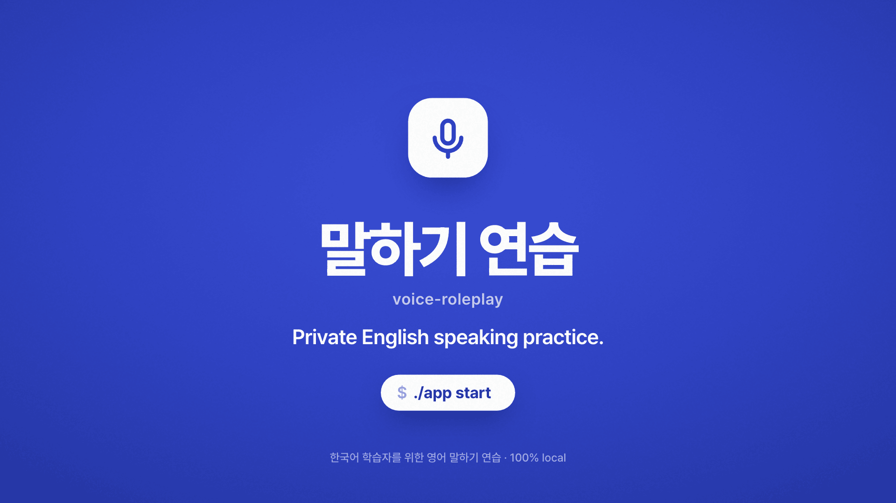
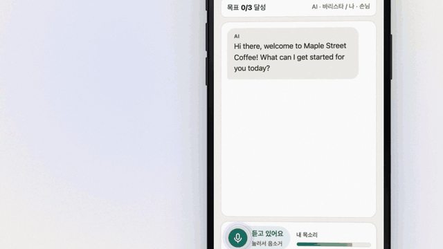
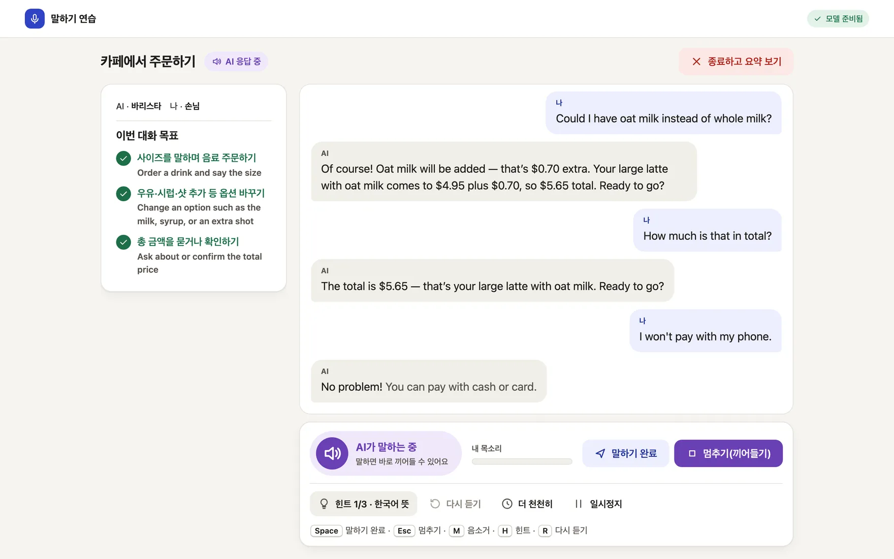
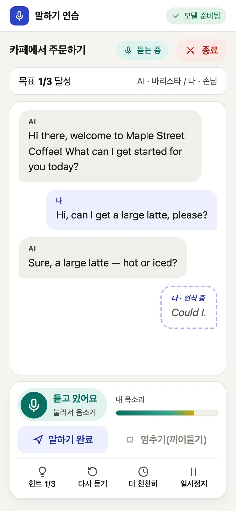
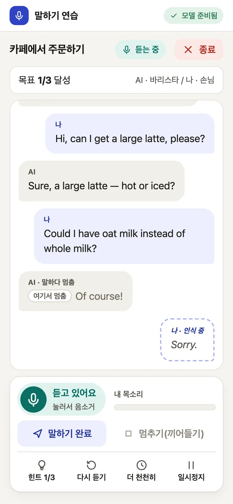
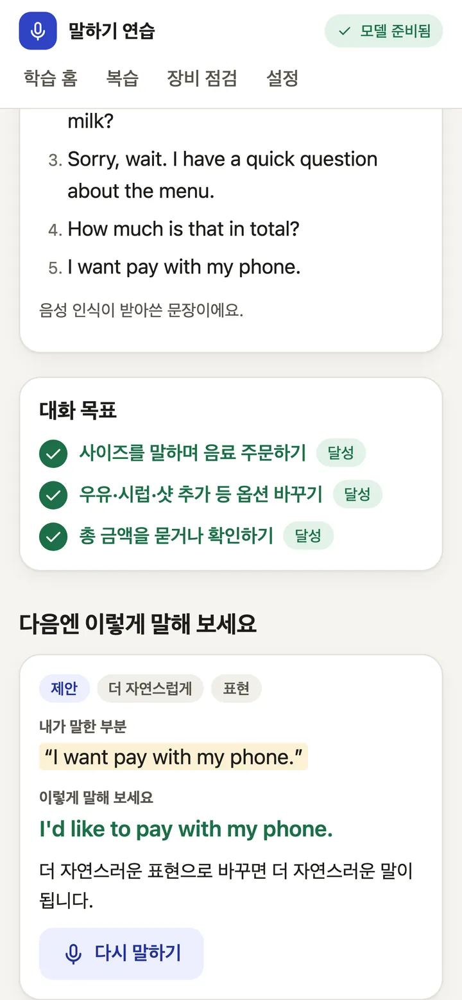
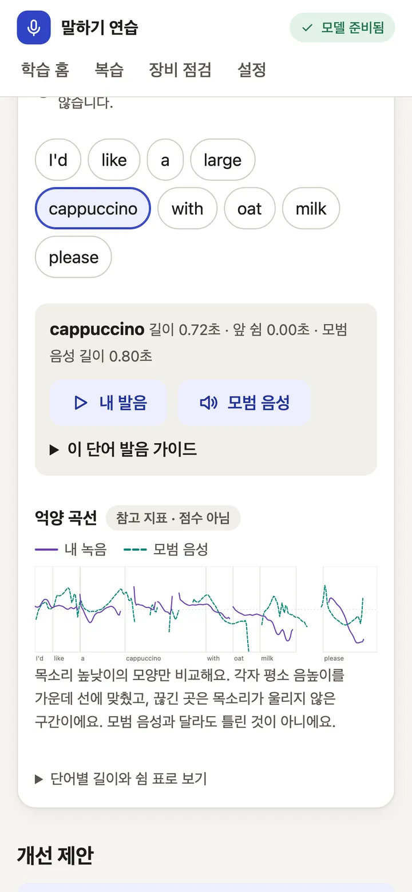
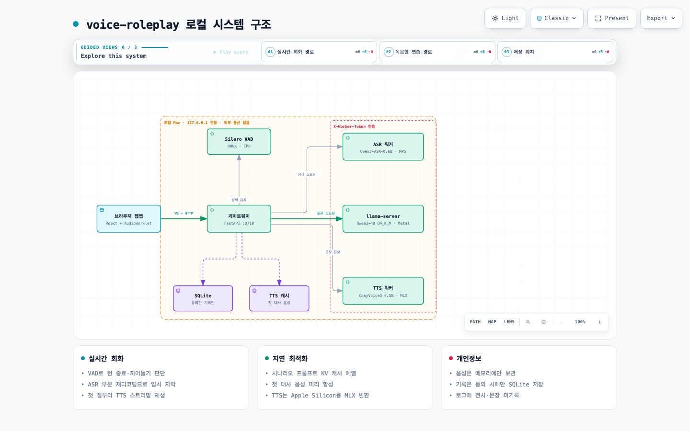

<p align="center">
  <a href="https://cskwork.github.io/voice-roleplay/">
    
  </a>
</p>

<h1 align="center">voice-roleplay</h1>

<p align="center">
  <b>Practise speaking English out loud with an AI roleplay partner, 100% on your Mac.</b><br>
  Live captions, a natural voice, barge-in and hints. Offline after setup. Your voice never leaves the machine.
</p>

<p align="center">
  <a href="LICENSE"></a>
  
  
  
  
  
  
  
  <a href="https://github.com/cskwork/voice-roleplay/stargazers"></a>
</p>

<p align="center">
  <a href="https://cskwork.github.io/voice-roleplay/"><b>Website</b></a> ·
  <a href="https://cskwork.github.io/voice-roleplay/media/voice-roleplay-launch-1080p.mp4">30-second video</a> ·
  <a href="#quick-start">Quick start</a> ·
  <a href="#measured-numbers">Benchmarks</a> ·
  <a href="README.ko.md">한국어</a>
</p>

<p align="center">
  
</p>

## Why

Speaking a foreign language out loud is the part most learners skip. Talking to a person can feel like too much, and cloud practice apps send every word you say to a server. voice-roleplay (말하기 연습 in the app) gives Korean learners of English a patient partner for everyday situations. Speech recognition, the language model and the voice all run on your own Mac, bound to `127.0.0.1`. Once `./app setup` has finished, nothing needs the network.

It is also a working example of a full local voice loop on a laptop: streaming ASR with live partial captions, an LLM streaming into sentence-by-sentence TTS, voice activity detection for turn-taking, and barge-in that cancels generation mid-sentence.

## Features

The app's interface is in Korean because it is built for Korean learners. The conversation is in English. Every screenshot below is real app output; for the captures, the learner's lines were spoken by macOS `say`.

<p align="center">
  
</p>

**Realtime roleplay**

- **Live captions.** Your words appear while you speak and settle into the final transcript when you pause.
- **A natural voice.** Replies stream sentence by sentence through CosyVoice3, so the AI starts talking before the whole answer exists.
- **Barge-in.** Start talking while the AI speaks and it stops, marks where it stopped and listens. Only the words it actually said stay in the history.
- **Hint ladder.** Stuck? Take one step at a time: the Korean meaning of the AI's last line, then key words, then a full example sentence.
- **Goals and a session summary.** Each scenario has goals that tick off as you reach them. Afterwards you see what you said and a more natural way to say a line, with a "say it again" drill.

**Recorded practice**

- Read a sentence, shadow the model voice, answer freely, or roleplay turn by turn. You get a transcript and written feedback on grammar and phrasing.
- With the optional word-timing worker: tap any word to hear your take next to the model voice, and compare pitch contours. This is a reference for your ear. There is **no pronunciation score**.

| Live captions | Barge-in | Summary and "say it again" | My take vs model voice |
|---|---|---|---|
|  |  |  |  |

Four scenarios so far: ordering at a cafe, asking for directions, hotel check-in and a job interview. Their sentences and translations are drafts that still need native-speaker review.

## Quick start

```sh
git clone https://github.com/cskwork/voice-roleplay.git
cd voice-roleplay
./app setup    # lists what it will install and asks y/N (--yes skips the prompt)
./app start    # prints http://127.0.0.1:8710 once the workers are warm
```

`./app doctor` prints a table of your machine, runtimes, model hashes, ports, voices and offline readiness. `./app stop` cancels running work and shuts every worker down.

The first start takes about 25 s to load the models, plus about a minute, once per scenario, to synthesise its opening line (cached in `var/cache/tts/` afterwards).

### Requirements

- An Apple Silicon Mac. Validated on an M3 Pro with 36 GB; smaller machines are untested.
- About 30 GB of free disk: models take about 19 GB and the Python environments about 5.5 GB.
- [uv](https://docs.astral.sh/uv/), git, Node.js 22 or newer, and `brew install llama.cpp`.
- Optional: Xcode Command Line Tools, so setup can build pyworld for the word-timing worker. Without them setup warns and finishes without that feature.
- A headset is recommended. Echo from speakers can trigger barge-in.

### What setup does

It runs `uv sync --frozen` for each Python component, clones `vendor/CosyVoice` at a pinned commit, runs `npm ci && npm run build` in `apps/web`, and downloads only the files listed in [`models.lock.json`](models.lock.json) at pinned revisions, checking each SHA-256. Setup is the only step that uses the network. `./app start` downloads nothing and refuses to start if a model file or environment is missing.

## How it works

<p align="center">
  
</p>

```
 Browser (apps/web, React)
   │  HTTP + WebSocket on 127.0.0.1:8710, cookie + CSRF + Origin checks
   ▼
 gateway (services/gateway, FastAPI)
   ├─ Silero VAD (onnxruntime, CPU): speech start/end, barge-in
   ├─ realtime engine: ASR stream → LLM stream → sentence splitter → TTS stream
   ├─ recorded-practice job queue (1 running, 2 waiting, audio in memory only)
   ├─ feedback, goals, hints, summary (workers/feedback)
   └─ SQLite (var/data), only if the learner opts in to history
        │ X-Worker-Token (new on every start)
        ├──▶ ASR worker   :8711  Qwen3-ASR-0.6B (transformers, MPS)
        ├──▶ TTS worker   :8712  Fun-CosyVoice3-0.5B-2512 (MLX by default, PyTorch optional)
        ├──▶ llama-server :8713  Qwen3-4B-Instruct-2507 Q4_K_M (slot 0 conversation, slot 1 background)
        └──▶ pron worker  :8714  optional: Qwen3-ForcedAligner-0.6B word timings, pyworld pitch
```

Diagrams for the system, one realtime turn with barge-in, and the session state machine are in [`docs/architecture/`](docs/architecture/README.md). Component contracts are in [`contracts/PROTOCOL.md`](contracts/PROTOCOL.md) and the product requirements in [`docs/PRD.md`](docs/PRD.md) (both in Korean).

## Measured numbers

200 realtime turns on an Apple M3 Pro with 36 GB (2026-09-28), with 66 barge-ins, plus seven recorded-practice jobs. Targets come from the project's PRD. The learner's voice was macOS `say` fed through the app's real capture path, so treat these as best-case numbers. Full report: [`benchmarks/results/2026-09-29-m3pro.md`](benchmarks/results/2026-09-29-m3pro.md).

| Metric | Target | Measured | |
|---|---|---|---|
| Reply starts (last voiced sample → AI audio plays), p50 | ≤ 2.0 s | 3.26 s | ❌ missed |
| Reply starts, p95 | ≤ 4.0 s | 4.43 s | ❌ missed |
| TTS real-time factor per reply, p95 | ≤ 0.80 | 0.87 | ❌ missed |
| First live caption, p95 | ≤ 3.0 s | 0.66 s | ✅ met |
| Barge-in stops the AI, p95 | ≤ 0.35 s | 0.20 s | ✅ met |
| Recorded 30 s answer, full result, p95 | ≤ 25 s | 20.3 s | ✅ met |
| Recorded 120 s answer, full result, p95 | ≤ 60 s | 52.5 s | ✅ met |

Most of the ~3.3 s reply start is the 0.9 s end-of-turn silence, final ASR, and the TTS first chunk (p50 1.17 s). In 50 of 134 uninterrupted replies, TTS fell behind playback for more than 50 ms. With every model loaded the five processes used about 22.7 GB of memory. Not measured yet: stop-button latency, 60-minute stability, memory reclaim over 10 sessions, and word error rate on real learner speech.

## Privacy

- Every server binds to `127.0.0.1`. There is no LAN or cloud mode.
- Microphone audio is never written to disk or the database. Recorded-practice audio is freed from memory when the job ends, fails or is cancelled. The per-word "my take" playback uses the recording kept in browser memory, which is dropped after 5 minutes or when you close the page.
- Transcripts and feedback live in session memory unless you turn on history; unsaved summaries disappear after 15 minutes. With history on they go to `var/data/app.sqlite3`, and you can delete everything from settings.
- Logs hold event names, ids, durations, states and error codes. Transcripts, TTS text, prompts, LLM output and audio are never logged.
- No telemetry, CDN or model downloads at runtime. Workers start with `HF_HUB_OFFLINE=1` and `TRANSFORMERS_OFFLINE=1`.
- macOS can still leave traces in swap or crash dumps even though the app writes nothing. Use disk encryption if that matters to you.

## Status and limitations

This is a development build and has not passed the project's own release criteria.

- Validated on one machine, an Apple M3 Pro (36 GB) on macOS. The Linux + NVIDIA path (vLLM streaming ASR) exists in code but has never been run.
- Replies start about 3.3 s after you stop talking (p50); the target is 2 s.
- There is no pronunciation scoring: `pronunciation_score` is always `null`. Word-level bands exist only behind `VR_PRON_EXPERIMENTAL=1`. Their calibration was fitted on Mandarin-L1 speakers (speechocean762) and has not been validated on Korean learners, so they are off by default. See [`docs/pronunciation.md`](docs/pronunciation.md).
- Scenario sentences, Korean translations and model expressions are drafts. They need native-speaker and translator review ([`content/README.md`](content/README.md)).
- The level-1 Korean translation is generated by the local LLM and can be wrong.
- All 16 Playwright specs pass on the real stack, with the learner's microphone replaced by synthetic speech.

## Roadmap

From [`docs/TRIAGE.md`](docs/TRIAGE.md) (Korean):

- [ ] A consented Korean-learner speech set (target: 20+ speakers, 400 utterances) with human ratings from at least two raters, to validate pronunciation feedback before any score or band is shown
- [ ] Faster reply start (currently p50 3.26 s against a 2 s target) and fewer TTS stalls in long replies
- [ ] Native-speaker and translator review of every scenario, translation and model expression
- [ ] Short articulation guides for sounds Korean speakers often find hard (r/l, f/p, v/b, th), after review
- [ ] A test run on Linux with an NVIDIA GPU
- [ ] Real microphone and speaker device smoke tests

## Contributing

Issues and pull requests are welcome. The most useful help right now:

- Native English speakers reviewing the scenarios in [`content/scenarios/`](content/scenarios/), and Korean speakers reviewing the translations.
- Running `./app setup && ./app start` on other hardware and reporting what happened, especially Macs with less than 36 GB and Linux machines with NVIDIA GPUs.
- Latency work on the realtime path. The benchmark harness is `benchmarks/run.sh`.

Tests:

```sh
cd services/gateway && .venv/bin/python -m pytest                        # fake workers + real Silero VAD
cd workers/pronunciation && .venv/bin/python -m pytest
cd apps/web && npm run build && npx vitest run
uv run --no-project --with jsonschema --with pytest python -m pytest tests/content
services/gateway/.venv/bin/python tests/integration/stack_smoke.py      # after ./app start, with real models
```

## Credits and licences

| Component | Source | Licence |
|---|---|---|
| Speech recognition | [Qwen/Qwen3-ASR-0.6B](https://huggingface.co/Qwen/Qwen3-ASR-0.6B) | Apache-2.0 |
| Conversation | [Qwen3-4B-Instruct-2507](https://huggingface.co/unsloth/Qwen3-4B-Instruct-2507-GGUF), GGUF Q4_K_M by unsloth, served by [llama.cpp](https://github.com/ggml-org/llama.cpp) | Apache-2.0 / MIT |
| Voice | [FunAudioLLM/Fun-CosyVoice3-0.5B-2512](https://huggingface.co/FunAudioLLM/Fun-CosyVoice3-0.5B-2512), MLX conversion by [mlx-community](https://huggingface.co/mlx-community/Fun-CosyVoice3-0.5B-2512-fp16) | Apache-2.0 |
| Turn-taking | [Silero VAD](https://github.com/snakers4/silero-vad) (ONNX) | MIT |
| Word timing (optional) | [Qwen/Qwen3-ForcedAligner-0.6B](https://huggingface.co/Qwen/Qwen3-ForcedAligner-0.6B), [pyworld](https://github.com/JeremyCCHsu/Python-Wrapper-for-World-Vocoder) | Apache-2.0 / MIT |
| Phones (experimental) | [facebook/wav2vec2-lv-60-espeak-cv-ft](https://huggingface.co/facebook/wav2vec2-lv-60-espeak-cv-ft), [CMUdict](https://github.com/cmusphinx/cmudict) | Apache-2.0 / BSD-style |

Every model file, revision, hash and licence note is pinned in [`models.lock.json`](models.lock.json).

**Voices.** The two AI voices are LibriTTS-R speakers, used as voice prompts under CC BY 4.0:

> Voice prompt from LibriTTS-R (Y. Koizumi, H. Zen, S. Karita et al., 2023), https://www.openslr.org/141/, speaker 4992, licensed CC BY 4.0. Derived from LibriTTS and LibriVox recordings.
>
> Voice prompt from LibriTTS-R (Y. Koizumi, H. Zen, S. Karita et al., 2023), https://www.openslr.org/141/, speaker 1188, licensed CC BY 4.0. Derived from LibriTTS and LibriVox recordings.

The original readers did not specifically agree to voice cloning; the product owner chose these voices knowing that (`content/voices/*/SOURCE.md`).

**Fonts and video.** The website and launch video use subsets of [Pretendard](https://github.com/orioncactus/pretendard) by Kil Hyung-jin (SIL Open Font License 1.1), renamed as the licence requires. The launch video's music and sound effects were synthesised from scratch; see [`marketing/launch-video/CREDITS.md`](marketing/launch-video/CREDITS.md).

**This repository.** Code and content are licensed under the [Apache License 2.0](LICENSE); third-party material is listed in [`NOTICE`](NOTICE). Model weights are not included: `./app setup` downloads them from their publishers, and each keeps its own licence.

## Star history

<a href="https://star-history.com/#cskwork/voice-roleplay&Date">
  <picture>
    <source media="(prefers-color-scheme: dark)" srcset="https://api.star-history.com/svg?repos=cskwork/voice-roleplay&type=Date&theme=dark">
    
  </picture>
</a>

<p align="center">
  ⭐ <b>If this helps you, star the repo.</b> It helps other learners and contributors find it.
</p>
