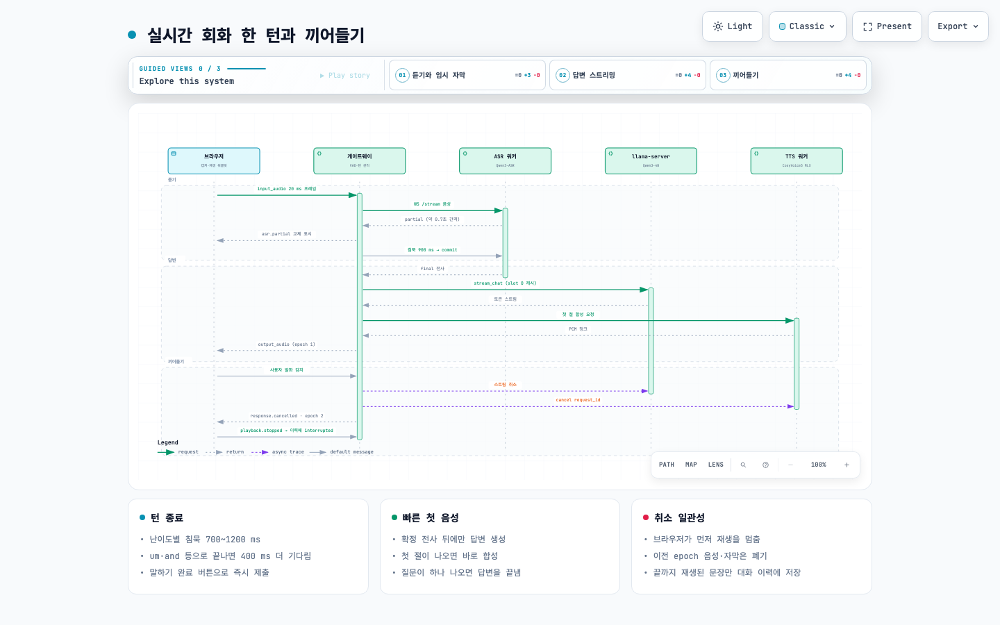
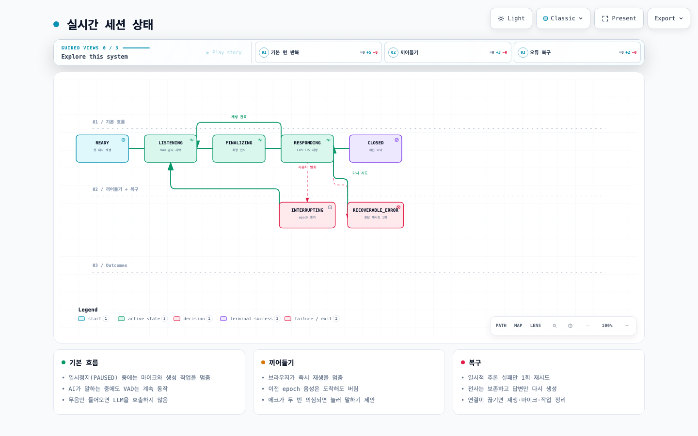

# 구조 문서

세 장의 구조도가 있습니다. 각 HTML은 브라우저에서 바로 열 수 있고(확대·검색·단계별 보기·내보내기 지원), PNG는 미리보기입니다. 원본 명세는 같은 이름의 `.json`이며 [archify](https://github.com/tt-a1i/archify)로 렌더링했습니다.

| 구조도 | 내용 | 파일 |
|---|---|---|
| 시스템 구조 | 브라우저, 게이트웨이, VAD, ASR·LLM·TTS 워커, 저장소와 경계 (선택 구성 요소인 발음 워커는 아래 설명에만 있음) | [system.html](system.html) · [system.json](system.architecture.json) |
| 실시간 한 턴 | 음성 프레임 → 임시 자막 → 확정 전사 → LLM 스트림 → TTS 재생, 그리고 끼어들기 취소 | [realtime-turn.html](realtime-turn.html) · [json](realtime-turn.sequence.json) |
| 세션 상태 | READY → LISTENING → FINALIZING → RESPONDING 반복, 끼어들기와 오류 복구 | [session-state.html](session-state.html) · [json](session-state.lifecycle.json) |

## 시스템 구조

- 모든 프로세스는 `127.0.0.1`에만 바인딩합니다. 게이트웨이(:8710)만 브라우저와 통신하고, 워커(:8711 ASR, :8712 TTS, :8713 LLM)는 게이트웨이가 시작할 때 만든 `X-Worker-Token`이 있어야 응답합니다.
- VAD(Silero, ONNX)는 게이트웨이 프로세스 안에서 CPU로 돌며, 턴 종료와 끼어들기를 판단합니다.
- SQLite에는 학습자가 기록 저장에 동의한 전사·피드백만 들어갑니다. TTS 캐시는 시나리오 첫 대사 같은 서비스 자산만 담습니다. 마이크 음성은 어디에도 쓰지 않습니다.
- 그림에는 아직 없는 선택 구성 요소로 발음 워커(:8714, `workers/pronunciation`)가 있습니다. Qwen3-ForcedAligner-0.6B로 단어 위치를, pyworld로 억양 곡선을 구하고, 실험 플래그를 켠 경우에만 wav2vec2 음소 모델로 등급을 냅니다. 녹음형 연습의 분석 단계(`analyzing`, 모범 음성 쪽은 `synthesizing`)에서만 호출되며, 실시간 세션 중에는 호출하지 않습니다. 워커가 없거나 실패해도 녹음형 결과는 그대로 나오고 발음 분석만 "비가용"으로 표시됩니다. 설명: [`docs/pronunciation.md`](../pronunciation.md), 계약: `contracts/PROTOCOL.md` §12.

## 실시간 한 턴과 끼어들기

1. 브라우저 AudioWorklet이 16 kHz PCM16을 20 ms 프레임으로 보냅니다(바이너리 envelope: 헤더 길이 + JSON 헤더 + PCM).
2. 게이트웨이는 VAD로 발화를 감지하고 ASR 워커의 WS `/stream`으로 음성을 넘깁니다. Apple Silicon에서는 vLLM 스트리밍 대신 약 0.7초 간격 부분 재디코딩으로 임시 자막을 만듭니다.
3. 침묵(난이도별 700~1200 ms, `um`·`and` 등으로 끝나면 400 ms 추가) 뒤 commit → 최종 전사가 나오면 LLM(slot 0, 시나리오 프롬프트 KV 캐시 예열됨)에 스트리밍 요청합니다.
4. 토큰은 문장 분할기를 거쳐 첫 절이 완성되는 즉시 TTS로 보내고, 첫 질문이 나오면 답변을 끝냅니다.
5. AI가 말하는 중 사용자가 말하면 브라우저가 먼저 재생을 멈추고, 게이트웨이는 LLM 스트림과 TTS 요청을 취소하고 `epoch`를 올립니다. 이전 epoch의 음성·자막은 도착해도 버립니다. 끝까지 재생된 문장만 대화 이력에 남습니다.

## 세션 상태

입력 상태와 출력 상태를 따로 관리합니다. `RESPONDING`은 LLM 생성·TTS 합성·재생이 겹치는 복합 상태이며, 이때도 VAD는 계속 동작합니다. `PAUSED`는 어느 상태에서든 들어갈 수 있고 마이크와 생성 작업을 멈춥니다(그림에서는 생략). 일시적인 추론 실패는 전사를 보존한 채 답변만 한 번 다시 만듭니다.

세부 계약은 [`contracts/PROTOCOL.md`](../../contracts/PROTOCOL.md), 제품 요구사항은 [`docs/PRD.md`](../PRD.md)에 있습니다.
